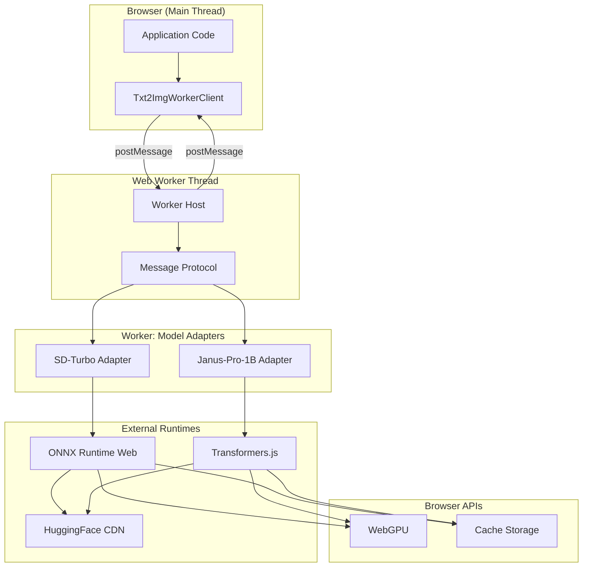
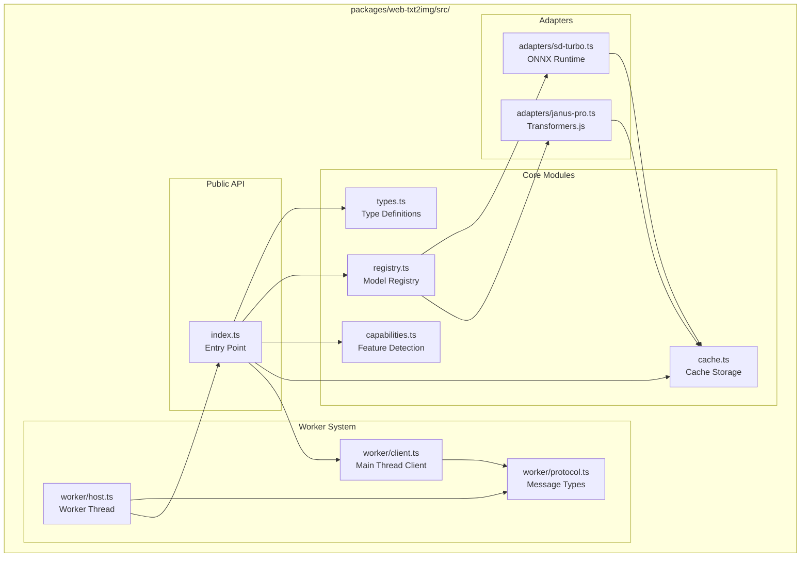
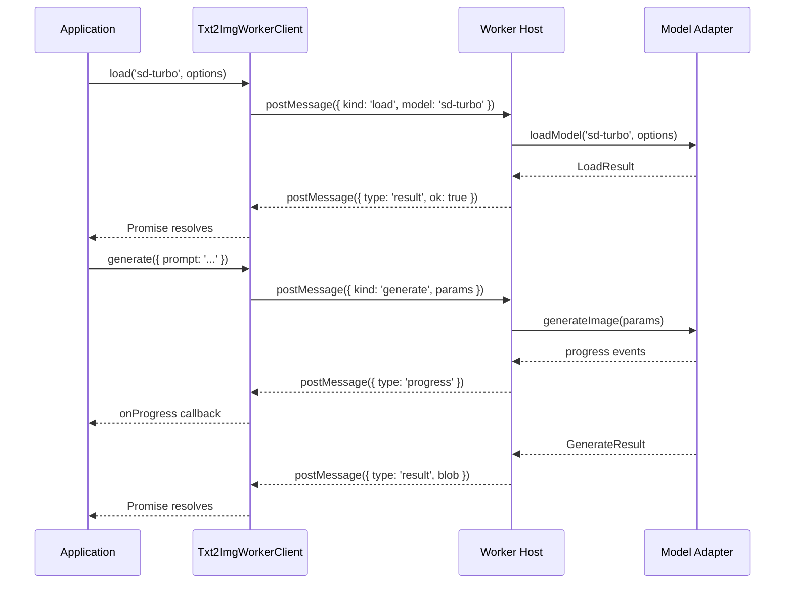
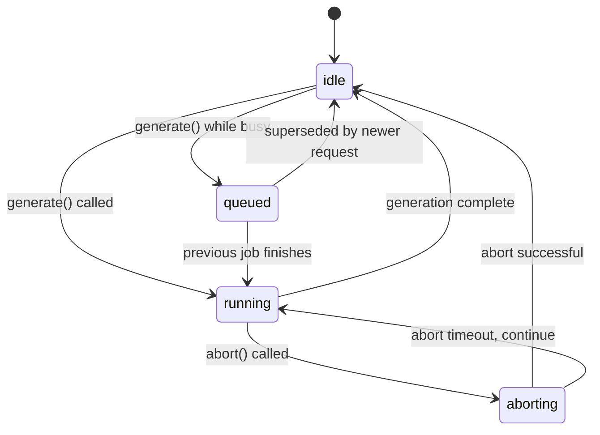
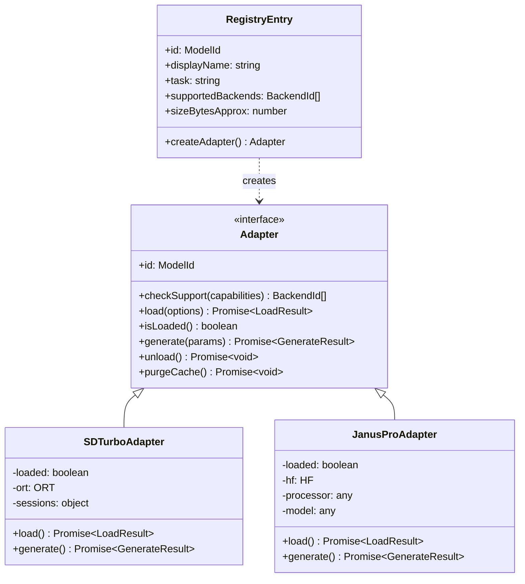
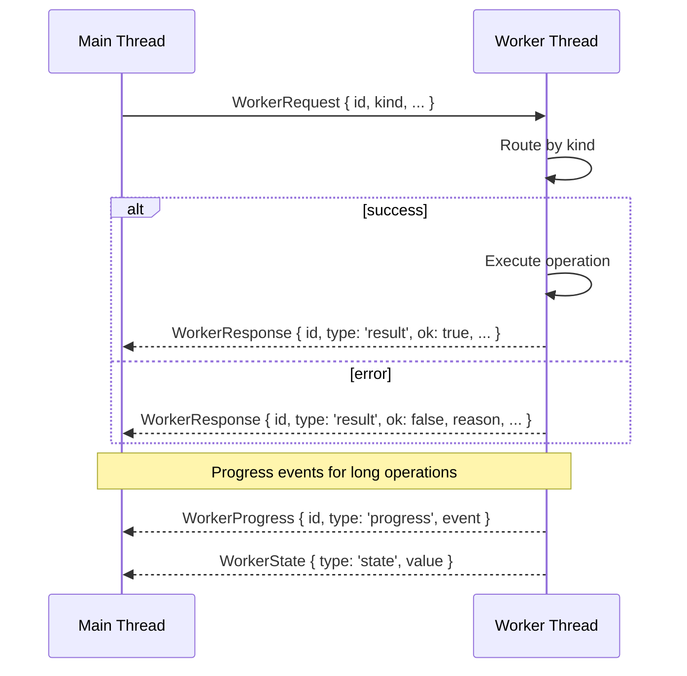
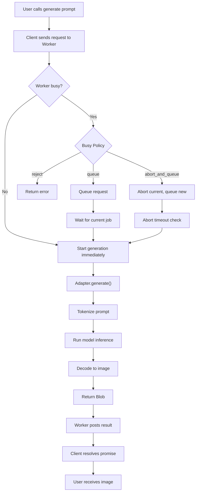
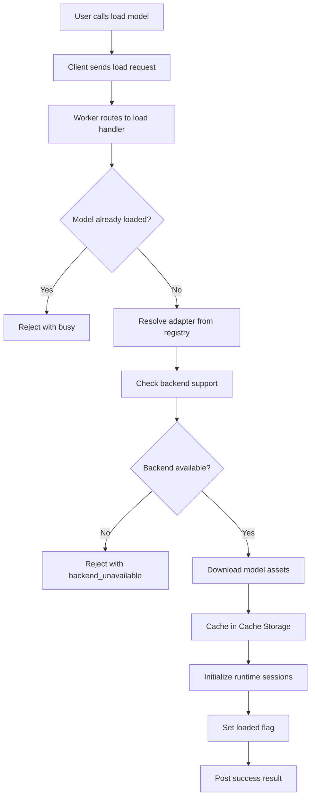
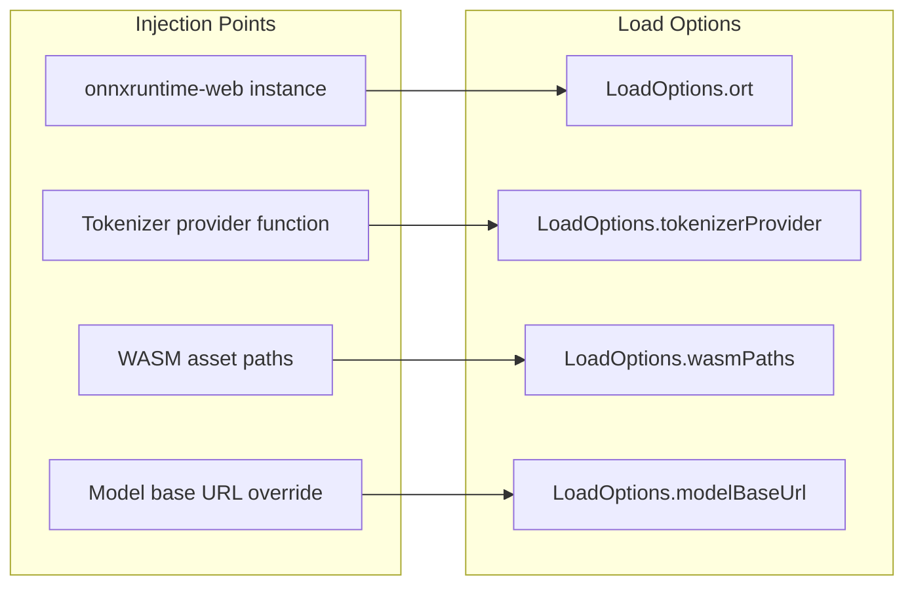
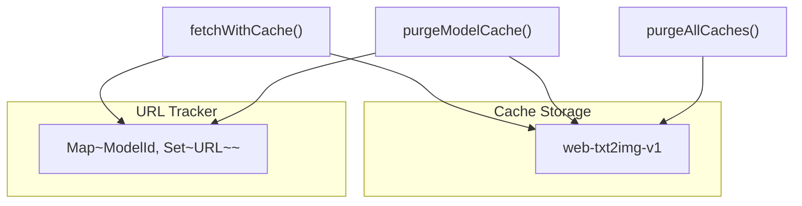

# Architecture

Module-level architecture of **web-txt2img** — a browser-only text-to-image library using WebGPU-accelerated AI models.

---

## Table of Contents

- [System Overview](#system-overview)
- [Module Architecture](#module-architecture)
- [Worker System](#worker-system)
- [Model Adapter System](#model-adapter-system)
- [Communication Protocol](#communication-protocol)
- [Data Flow](#data-flow)
- [State Management](#state-management)
- [Dependency Injection](#dependency-injection)
- [Cache Layer](#cache-layer)

---

## System Overview



The library runs entirely in the browser. All heavy computation (model loading, inference) is offloaded to a Web Worker thread to keep the main thread responsive.

---

## Module Architecture



### Module Responsibilities

| Module | Path | Responsibility |
|---|---|---|
| **index.ts** | `src/index.ts` | Public API entry point; exports all functions and types |
| **types.ts** | `src/types.ts` | Core type definitions: `ModelId`, `BackendId`, `Adapter`, `GenerateParams`, etc. |
| **registry.ts** | `src/registry.ts` | Model metadata, factory functions, backend preferences |
| **capabilities.ts** | `src/capabilities.ts` | Browser feature detection (WebGPU, WASM, shader-f16) |
| **cache.ts** | `src/cache.ts` | Cache Storage wrapper for model assets |
| **client.ts** | `src/worker/client.ts` | Main-thread client for worker communication |
| **host.ts** | `src/worker/host.ts` | Worker thread: message routing, job queue, lifecycle |
| **protocol.ts** | `src/worker/protocol.ts` | Request/response type definitions for worker messages |
| **sd-turbo.ts** | `src/adapters/sd-turbo.ts` | SD-Turbo model adapter using ONNX Runtime Web |
| **janus-pro.ts** | `src/adapters/janus-pro.ts` | Janus-Pro-1B adapter using Transformers.js |

---

## Worker System

### Architecture



### Worker Lifecycle



### Job Queue Policy

The worker maintains a **single-flight, single-slot queue**:

1. **Idle** → Start generation immediately
2. **Busy + `reject`** → Return error immediately
3. **Busy + `queue`** → Queue the request; run after current job finishes
4. **Busy + `abort_and_queue`** → Abort current job; queue new request
5. **Debouncing** → Delay start by `debounceMs` to coalesce rapid inputs

---

## Model Adapter System

### Adapter Interface

All adapters implement the `Adapter` interface from `types.ts`:

```typescript
interface Adapter {
  readonly id: ModelId;
  checkSupport(capabilities: Capabilities): BackendId[];
  load(options: LoadOptions): Promise<LoadResult>;
  isLoaded(): boolean;
  generate(params: Omit<GenerateParams, 'model'>): Promise<GenerateResult>;
  unload(): Promise<void>;
  purgeCache(): Promise<void>;
}
```

### Registry Pattern



### Model Comparison

| Feature | SD-Turbo | Janus-Pro-1B |
|---|---|---|
| **Runtime** | ONNX Runtime Web | Transformers.js |
| **Backend** | WebGPU (WASM experimental) | WebGPU only |
| **Model Size** | ~2.34 GB | ~2.25 GB |
| **Seed Support** | Yes | No |
| **Resolution** | 512×512 fixed | Variable |
| **Inference Steps** | 1 (turbo) | Autoregressive |

---

## Communication Protocol

### Message Flow



### Request Types

| Kind | Direction | Purpose |
|---|---|---|
| `detect` | → Worker | Detect browser capabilities |
| `listModels` | → Worker | List available models |
| `listBackends` | → Worker | List available backends |
| `load` | → Worker | Load a model into memory |
| `unload` | → Worker | Unload current model |
| `purge` | → Worker | Purge model cache |
| `purgeAll` | → Worker | Purge all caches |
| `generate` | → Worker | Generate image from prompt |
| `abort` | → Worker | Abort current generation |

### Response Types

| Type | Description |
|---|---|
| `result` | Final result (success or error) |
| `progress` | Progress update during operation |
| `accepted` | Acknowledgment for queued operations |
| `state` | Worker state change notification |

---

## Data Flow

### Image Generation Flow



### Model Loading Flow



---

## State Management

### Worker State

The worker maintains these state variables:

```typescript
// Current execution
let currentJob: CurrentJob | null = null;
let pendingJob: PendingJob | null = null;
let aborting = false;

// Model state
let loadedModel: ModelId | null = null;
let loadInFlight = false;

// Timers
let abortTimer: number | null = null;
let debounceTimer: number | null = null;
```

### Adapter State

Each adapter tracks:

```typescript
// Per-adapter state
private loaded = false;
private backendUsed: BackendId | null = null;
// Runtime-specific handles (ORT sessions, Transformers.js model, etc.)
```

---

## Dependency Injection

The library supports dependency injection for runtime flexibility:



### Resolution Order

For each dependency, the adapter tries:

1. **Injected value** — Passed via `LoadOptions`
2. **Dynamic import** — `import('onnxruntime-web')` etc.
3. **Global fallback** — `globalThis.ort`, `globalThis.transformers`

---

## Cache Layer

### Cache Architecture



### Cache Behavior

- **Name**: `web-txt2img-v1` (Cache Storage API)
- **Strategy**: Cache-first with network fallback
- **Scope**: Per-model URL tracking for targeted purging
- **Progress**: Streaming downloads report byte-level progress
- **Fallback**: Simulated progress when streaming is unavailable

### Cache Operations

| Function | Purpose |
|---|---|
| `fetchWithCache()` | Fetch with Cache Storage caching |
| `fetchArrayBufferWithCacheProgress()` | Fetch binary with progress reporting |
| `purgeModelCache(id)` | Delete cached assets for specific model |
| `purgeAllCaches()` | Delete all cached assets |
| `noteModelUrl(id, url)` | Track URL association with model |
