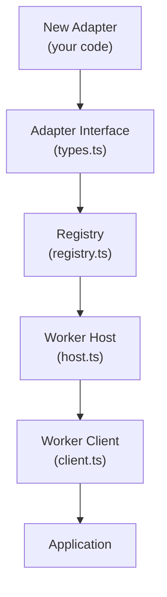
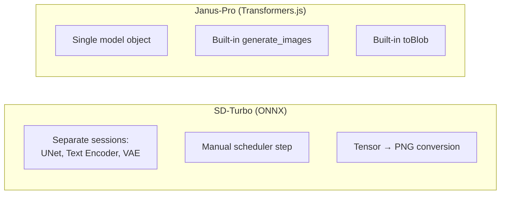
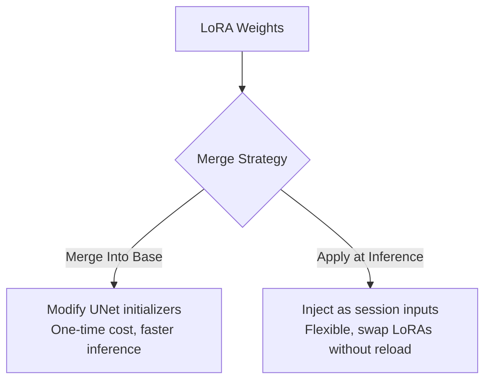

# Creating a New Web Worker Adapter

This guide walks you through creating a new model adapter for **web-txt2img** — from implementing the `Adapter` interface to registering it in the model registry and wiring it into the worker host.

---

## Table of Contents

- [Creating a New Web Worker Adapter](#creating-a-new-web-worker-adapter)
  - [Table of Contents](#table-of-contents)
  - [Overview](#overview)
    - [What You'll Build](#what-youll-build)
  - [Prerequisites](#prerequisites)
    - [Understand the Existing Patterns](#understand-the-existing-patterns)
    - [Key Differences](#key-differences)
    - [ONNX Runtime Backend Architecture](#onnx-runtime-backend-architecture)
    - [Transformers.js Model Types](#transformersjs-model-types)
    - [Transformers.js Tensor and Cache Internals](#transformersjs-tensor-and-cache-internals)
  - [Step 1: Define Your Model ID](#step-1-define-your-model-id)
    - [Naming Conventions](#naming-conventions)
  - [Step 2: Implement the Adapter Interface](#step-2-implement-the-adapter-interface)
    - [Minimal Skeleton](#minimal-skeleton)
    - [ONNX Runtime Session Configuration](#onnx-runtime-session-configuration)
    - [Transformers.js Device and Dtype Selection](#transformersjs-device-and-dtype-selection)
    - [Progress Callback Patterns](#progress-callback-patterns)
  - [Step 4: Wire Into the Worker Host](#step-4-wire-into-the-worker-host)
  - [Step 5: Test Your Adapter](#step-5-test-your-adapter)
    - [Manual Testing Checklist](#manual-testing-checklist)
  - [Full Sample: Generic Diffusion Adapter](#full-sample-generic-diffusion-adapter)
    - [File: `src/adapters/generic-diffusion.ts`](#file-srcadaptersgeneric-diffusionts)
  - [LoRA Integration](#lora-integration)
    - [Overview](#overview-1)
    - [Strategy 1: Merge Into Base (Recommended for Performance)](#strategy-1-merge-into-base-recommended-for-performance)
    - [Strategy 2: Apply at Inference (Recommended for Flexibility)](#strategy-2-apply-at-inference-recommended-for-flexibility)
    - [LoRA Weight Formats](#lora-weight-formats)
    - [Extending LoadOptions for LoRA](#extending-loadoptions-for-lora)
  - [Common Pitfalls](#common-pitfalls)
    - [Memory Leaks](#memory-leaks)
    - [Worker Communication](#worker-communication)
    - [Model Loading](#model-loading)
    - [TypeScript](#typescript)
  - [Checklist: Before You Ship](#checklist-before-you-ship)

---

## Overview

Every model in web-txt2img is an **adapter** — a class that implements the `Adapter` interface from `src/types.ts`. The adapter pattern decouples model-specific inference logic from the worker lifecycle, progress reporting, and job queuing.



### What You'll Build

1. **Adapter class** — Implements `load()`, `generate()`, `unload()`, etc.
2. **Registry entry** — Metadata + factory function
3. **Type updates** — Add your model ID to the `ModelId` union

---

## Prerequisites

### Understand the Existing Patterns

Before writing a new adapter, study these two reference implementations:

| Adapter | Runtime | File | Key Pattern |
|---|---|---|---|
| **SD-Turbo** | ONNX Runtime Web | `src/adapters/sd-turbo.ts` | Multi-session ONNX pipeline with manual scheduler |
| **Janus-Pro-1B** | Transformers.js | `src/adapters/janus-pro.ts` | Single-model pipeline with progress streamer |

### Key Differences



Choose your approach based on your runtime:
- **ONNX Runtime Web**: Multiple sessions, manual pipeline orchestration (like SD-Turbo)
- **Transformers.js**: High-level API, single model object (like Janus-Pro)

### ONNX Runtime Backend Architecture

ONNX Runtime Web uses a priority-based backend registration system. Understanding this helps debug backend selection issues:

| Backend | Priority | Notes |
|---|---|---|
| `webgpu` | 5 | GPU acceleration via WebGPU (recommended for all models) |
| `wasm` | 10 | WebAssembly fallback with SIMD |
| `cpu` | 10 | CPU execution via WASM |
| `webnn` | 5 | WebNN API (requires WebGPU or JSEP) |
| `webgl` | -10 | Legacy WebGL (disabled by default via BUILD_DEFS) |

Transformers.js maps device strings to ONNX execution providers:
- `webgpu` → WebGPU EP
- `wasm` → WASM EP with SIMD
- `cpu` → CPU EP via WASM
- Platform-specific: `dml` (Windows), `cuda` (Linux x64), `coreml` (macOS)

### Transformers.js Model Types

Transformers.js classifies models into architecture types, each with dedicated forward functions:

| Model Type | Can Generate | Forward Function | Use Case |
|---|---|---|---|
| `DecoderOnly` | ✅ | `decoder_forward` | LLMs, text generation |
| `Seq2Seq` | ✅ | `seq2seq_forward` | Translation, summarization |
| `Vision2Seq` | ✅ | `seq2seq_forward` | Image-to-text |
| `ImageTextToText` | ✅ | `image_text_to_text_forward` | Multimodal VLMs |
| `AudioTextToText` | ✅ | `audio_text_to_text_forward` | Speech-to-text |
| `MultiModality` | ✅ | Custom | Janus-Pro style (text + image gen) |
| `AutoEncoder` | ❌ | `auto_encoder_forward` | VAE, autoencoding |
| `default` | ❌ | `encoder_forward` | Classification, extraction |

When loading a model, Transformers.js auto-detects the architecture type. Cross-architecture loading (e.g., loading a `ForConditionalGeneration` model via `ForCausalLM`) will fall back to text-only mode.

### Transformers.js Tensor and Cache Internals

Transformers.js wraps ONNX Runtime tensors in a `Tensor` class:

```typescript
// Tensor properties
console.log(tensor.dims);       // Shape as number[]
console.log(tensor.type);       // 'float32', 'int64', etc.
console.log(tensor.data);       // Raw TypedArray
console.log(tensor.location);   // 'gpu-buffer', 'cpu', etc.
```

For generation models, Transformers.js uses a `DynamicCache` class to manage past key-value states:
- Stores cached attention states as named tensors
- `get_seq_length()` returns the past sequence length
- `update(newEntries)` updates cache in-place, disposing replaced GPU tensors
- `dispose()` frees all GPU-resident tensors

When implementing a custom generation loop, you'll interact with the cache via the model's forward pass output.

---

## Step 1: Define Your Model ID

Add your model ID to the `ModelId` union type in `src/types.ts`:

```typescript
// src/types.ts
export type ModelId = 'sd-turbo' | 'janus-pro-1b' | 'my-new-model';
```

### Naming Conventions

- Use **kebab-case** for model IDs (e.g., `'stable-diffusion-xl'`)
- Keep IDs short and descriptive
- Avoid special characters beyond hyphens

---

## Step 2: Implement the Adapter Interface

Create a new file `src/adapters/my-new-model.ts`. The `Adapter` interface requires these members:

```typescript
interface Adapter {
  readonly id: ModelId;
  checkSupport(capabilities: Capabilities): BackendId[];
  load(options: Required<Pick<LoadOptions, 'backendPreference'>> & LoadOptions): Promise<LoadResult>;
  isLoaded(): boolean;
  generate(params: Omit<GenerateParams, 'model'>): Promise<GenerateResult>;
  unload(): Promise<void>;
  purgeCache(): Promise<void>;
}
```

### Minimal Skeleton

```typescript
import type {
  Adapter,
  BackendId,
  Capabilities,
  GenerateParams,
  GenerateResult,
  LoadOptions,
  LoadResult,
} from '../types.js';
import { fetchArrayBufferWithCacheProgress, purgeModelCache } from '../cache.js';

export class MyNewModelAdapter implements Adapter {
  readonly id = 'my-new-model' as const;

  private loaded = false;
  private backendUsed: BackendId | null = null;

  // --- Runtime handles (add as needed) ---
  private model: any | null = null;

  // --- Backend support check ---
  checkSupport(c: Capabilities): BackendId[] {
    const backends: BackendId[] = [];
    if (c.webgpu) backends.push('webgpu');
    return backends;
  }

  // --- Model loading ---
  async load(options: Required<Pick<LoadOptions, 'backendPreference'>> & LoadOptions): Promise<LoadResult> {
    const chosen = options.backendPreference.find(
      (b) => b === 'webgpu'
    );
    if (!chosen) {
      return { ok: false, reason: 'backend_unavailable', message: 'WebGPU required' };
    }

    try {
      options.onProgress?.({ phase: 'loading', message: 'Loading model...' });

      // TODO: Download and initialize your model
      // Use fetchArrayBufferWithCacheProgress for cached downloads

      this.backendUsed = chosen;
      this.loaded = true;
      return { ok: true, backendUsed: chosen };
    } catch (e) {
      return { ok: false, reason: 'internal_error', message: String(e) };
    }
  }

  isLoaded(): boolean {
    return this.loaded;
  }

  // --- Image generation ---
  async generate(params: Omit<GenerateParams, 'model'>): Promise<GenerateResult> {
    if (!this.loaded) {
      return { ok: false, reason: 'model_not_loaded', message: 'Call loadModel() first' };
    }

    const { prompt, signal, onProgress } = params;
    if (!prompt?.trim()) {
      return { ok: false, reason: 'unsupported_option', message: 'Prompt is required' };
    }
    if (signal?.aborted) {
      return { ok: false, reason: 'cancelled' };
    }

    const start = performance.now();

    try {
      // TODO: Implement inference pipeline
      // 1. Tokenize prompt
      // 2. Run model
      // 3. Decode to image
      // 4. Return Blob

      const blob = new Blob(); // placeholder
      const timeMs = performance.now() - start;
      onProgress?.({ phase: 'complete', pct: 100, timeMs });
      return { ok: true, blob, timeMs };
    } catch (e) {
      return { ok: false, reason: 'internal_error', message: String(e) };
    }
  }

  // --- Cleanup ---
  async unload(): Promise<void> {
    // IMPORTANT: Release ONNX sessions to prevent memory leaks
    // this.sessions?.unet?.release();
    // this.model?.dispose(); // For Transformers.js models
    this.model = null;
    this.loaded = false;
    this.backendUsed = null;
  }

  async purgeCache(): Promise<void> {
    await purgeModelCache(this.id);
  }
}
```

### ONNX Runtime Session Configuration

When creating ONNX sessions, use these options for optimal performance:

```typescript
const sessionOpts = {
  executionProviders: ['webgpu'],        // GPU acceleration
  enableMemPattern: false,               // Disable for dynamic shapes
  enableCpuMemArena: false,              // Disable when using WebGPU
  freeDimensionOverrides: {              // Override dynamic dimensions
    batch_size: 1,
    sequence_length: 77,
    height: 64,
    width: 64,
  },
};

const session = await ort.InferenceSession.create(modelBuffer, sessionOpts);
```

**Important:** `freeDimensionOverrides` must match your model's input shapes. Check the ONNX model's input metadata to determine correct values.

### Transformers.js Device and Dtype Selection

Transformers.js supports per-submodel device and dtype assignment for mixed precision:

```typescript
// Check for fp16 support
const adapter = await navigator.gpu?.requestAdapter();
const fp16Supported = !!adapter?.features?.has('shader-f16');

// Per-submodel dtype configuration
const dtype = fp16Supported
  ? { prepare_inputs_embeds: 'q4', language_model: 'q4f16', lm_head: 'fp16' }
  : { prepare_inputs_embeds: 'fp32', language_model: 'q4', lm_head: 'fp32' };

// Per-submodel device configuration
const device = {
  prepare_inputs_embeds: 'wasm',    // Small model on WASM
  language_model: 'webgpu',         // Large model on GPU
  lm_head: 'webgpu',
};

const model = await MultiModalityCausalLM.from_pretrained(modelId, {
  dtype,
  device,
  progress_callback,  // For download progress
});
```

Supported dtypes: `fp32`, `fp16`, `q4`, `q4f16`, `q8`
Supported devices: `webgpu`, `wasm`, `cpu`, `coreml`, `cuda`, `dml`

### Progress Callback Patterns

Transformers.js progress callbacks receive this shape:

```typescript
{
  file: string,        // File being downloaded
  loaded: number,      // Bytes loaded so far
  progress: number,    // 0-1 progress
  total: number,       // Total bytes
  status: string,      // 'downloading', 'done', etc.
}
```

For aggregated progress across multiple files, track per-asset bytes:```typescript
const seen = new Map<string, number>();
const progressCallback = (x: any) => {
  const name = x?.file ?? x?.name ?? 'asset';
  const loaded = x?.loaded ?? 0;
  const prev = seen.get(name) ?? 0;
  seen.set(name, Math.max(prev, loaded));
  const totalLoaded = Array.from(seen.values()).reduce((a, b) => a + b, 0);
  // Emit aggregated progress...
};
```

---

## Step 3: Register in the Model Registry

Add your adapter to `src/registry.ts`:

```typescript
import { MyNewModelAdapter } from './adapters/my-new-model.js';

const REGISTRY: RegistryEntry[] = [
  // ... existing entries ...
  {
    id: 'my-new-model',
    displayName: 'My New Model',
    task: 'text-to-image',
    supportedBackends: ['webgpu'],
    notes: 'Description of your model.',
    sizeBytesApprox: 2048 * 1024 * 1024, // ~2 GB
    sizeGBApprox: 2.0,
    sizeNotes: 'Approximate download size',
    createAdapter: () => new MyNewModelAdapter(),
  },
];

// Update defaultBackendPreferenceFor switch:
export function defaultBackendPreferenceFor(id: ModelId): BackendId[] {
  switch (id) {
    case 'sd-turbo':
      return ['webgpu', 'wasm'];
    case 'janus-pro-1b':
      return ['webgpu'];
    case 'my-new-model':
      return ['webgpu'];
  }
}
```

---

## Step 4: Wire Into the Worker Host

The worker host (`src/worker/host.ts`) uses the public API from `src/index.ts`. Since you registered your adapter in the registry, it's automatically available — no host changes needed.

Verify by checking that `listSupportedModels()` includes your model:

```bash
npm run build:lib
npm run dev:vanilla
# Open browser console:
import { listSupportedModels } from 'web-txt2img';
console.log(listSupportedModels());
```

---

## Step 5: Test Your Adapter

### Manual Testing Checklist

| Test | Command / Action |
|---|---|
| Type check passes | `npm run typecheck` |
| Library builds | `npm run build:lib` |
| Model appears in list | Check `listSupportedModels()` in console |
| Model loads | `await client.load('my-new-model')` |
| Generation works | `await client.generate({ model: 'my-new-model', prompt: 'test' })` |
| Progress events fire | Monitor `onProgress` callback |
| Abort works | Call `client.abort()` during generation |
| Unload works | `await client.unload()` |
| Cache purge works | `await client.purge()` |

---

## Full Sample: Generic Diffusion Adapter

Below is a complete, production-ready adapter skeleton for a diffusion-based model. This demonstrates the full inference pipeline including LoRA support.

### File: `src/adapters/generic-diffusion.ts`

```typescript
import type {
  Adapter,
  BackendId,
  Capabilities,
  GenerateParams,
  GenerateResult,
  LoadOptions,
  LoadResult,
} from '../types.js';
import { fetchArrayBufferWithCacheProgress, purgeModelCache } from '../cache.js';

// ---------------------------------------------------------------------------
// LoRA Configuration
// ---------------------------------------------------------------------------

/**
 * LoRA (Low-Rank Adaptation) hook configuration.
 * Attach fine-tuned weight deltas to the base model at inference time.
 */
export interface LoraConfig {
  /** HuggingFace model path or local URL for the LoRA weights */
  url: string;
  /** Scaling factor (1.0 = full strength, 0.5 = half strength) */
  scale?: number;
  /** Optional: merge LoRA into base weights instead of applying at inference */
  mergeIntoBase?: boolean;
}

// ---------------------------------------------------------------------------
// Adapter Implementation
// ---------------------------------------------------------------------------

export class GenericDiffusionAdapter implements Adapter {
  readonly id = 'generic-diffusion' as const;

  private loaded = false;
  private backendUsed: BackendId | null = null;

  // --- Runtime handles ---
  private ort: any | null = null;
  private sessions: {
    unet?: any;
    textEncoder?: any;
    vaeDecoder?: any;
    vaeEncoder?: any;
  } = {};
  private tokenizerFn: ((text: string, opts?: any) => Promise<{ input_ids: number[] }>) | null = null;

  // --- LoRA state ---
  private activeLoras: Map<string, LoraConfig> = new Map();
  private loraMerged = false;

  // --- Model configuration ---
  private modelBase = 'https://huggingface.co/your-org/your-model/resolve/main';
  private readonly latentHeight = 64;
  private readonly latentWidth = 64;
  private readonly outputHeight = 512;
  private readonly outputWidth = 512;
  private readonly noiseSigma = 14.6146;
  private readonly vaeScalingFactor = 0.18215;

  // -----------------------------------------------------------------------
  // Adapter Interface
  // -----------------------------------------------------------------------

  checkSupport(c: Capabilities): BackendId[] {
    const backends: BackendId[] = [];
    if (c.webgpu) backends.push('webgpu');
    return backends;
  }

  async load(options: Required<Pick<LoadOptions, 'backendPreference'>> & LoadOptions): Promise<LoadResult> {
    const chosen = options.backendPreference.find(
      (b) => b === 'webgpu'
    );
    if (!chosen) {
      return { ok: false, reason: 'backend_unavailable', message: 'WebGPU required' };
    }

    // Resolve overrides
    if (options.modelBaseUrl) this.modelBase = options.modelBaseUrl;
    if (options.tokenizerProvider) {
      this.tokenizerFn = await options.tokenizerProvider();
    }

    // --- Load ONNX Runtime ---
    try {
      let ort: any = options.ort ?? null;
      if (!ort) {
        ort = await import('onnxruntime-web/webgpu').catch(() => null);
        ort = ort?.default ?? ort;
      }
      if (!ort) {
        ort = (globalThis as any).ort;
      }
      if (!ort) {
        return { ok: false, reason: 'internal_error', message: 'onnxruntime-web not available' };
      }
      this.ort = ort;
    } catch (e) {
      return { ok: false, reason: 'internal_error', message: String(e) };
    }

    // --- Download and create sessions ---
    try {
      const ort = this.ort;
      const sessionOpts: any = {
        executionProviders: ['webgpu'],
        enableMemPattern: false,
        enableCpuMemArena: false,
      };

      const models = {
        unet: {
          url: 'unet/model.onnx',
          sizeMB: 640,
          dimOverrides: { batch_size: 1, num_channels: 4, height: this.latentHeight, width: this.latentWidth, sequence_length: 77 },
        },
        textEncoder: {
          url: 'text_encoder/model.onnx',
          sizeMB: 1700,
          dimOverrides: { batch_size: 1 },
        },
        vaeDecoder: {
          url: 'vae_decoder/model.onnx',
          sizeMB: 95,
          dimOverrides: { batch_size: 1, num_channels_latent: 4, height_latent: this.latentHeight, width_latent: this.latentWidth },
        },
      } as const;

      const fallbackTotal = Object.values(models).reduce(
        (acc, m) => acc + m.sizeMB * 1024 * 1024, 0
      );
      const grandTotal = typeof options.approxTotalBytes === 'number'
        ? options.approxTotalBytes
        : fallbackTotal;

      let bytesDownloaded = 0;
      options.onProgress?.({
        phase: 'loading',
        message: `Downloading model (~${Math.round(grandTotal / 1024 / 1024)}MB)...`,
        bytesDownloaded: 0,
        totalBytesExpected: grandTotal,
        pct: 0,
        accuracy: 'exact',
      });

      for (const [key, model] of Object.entries(models)) {
        options.onProgress?.({ phase: 'loading', message: `Downloading ${model.url}...`, bytesDownloaded });

        const buf = await fetchArrayBufferWithCacheProgress(
          `${this.modelBase}/${model.url}`,
          this.id,
          (loaded, total) => {
            const pct = Math.min(100, Math.round(((bytesDownloaded + loaded) / grandTotal) * 100));
            options.onProgress?.({
              phase: 'loading',
              message: `Downloading ${model.url}...`,
              pct,
              bytesDownloaded: bytesDownloaded + loaded,
              totalBytesExpected: grandTotal,
              asset: model.url,
              accuracy: 'exact',
            });
          },
          model.sizeMB * 1024 * 1024
        );

        bytesDownloaded += buf.byteLength;
        const sess = await ort.InferenceSession.create(buf, {
          ...sessionOpts,
          freeDimensionOverrides: model.dimOverrides,
        });

        (this.sessions as any)[key] = sess;
      }

      // --- Load LoRA weights if configured ---
      if (options.loras && options.loras.length > 0) {
        for (const lora of options.loras) {
          await this.loadLora(lora, options);
        }
      }

      this.backendUsed = chosen;
      this.loaded = true;
      return { ok: true, backendUsed: chosen, bytesDownloaded };
    } catch (e) {
      return { ok: false, reason: 'internal_error', message: String(e) };
    }
  }

  isLoaded(): boolean {
    return this.loaded;
  }

  async generate(params: Omit<GenerateParams, 'model'>): Promise<GenerateResult> {
    if (!this.loaded) {
      return { ok: false, reason: 'model_not_loaded', message: 'Call loadModel() first' };
    }

    const { prompt, width, height, signal, onProgress, seed } = params;
    if (!prompt?.trim()) {
      return { ok: false, reason: 'unsupported_option', message: 'Prompt is required' };
    }

    const w = width ?? this.outputWidth;
    const h = height ?? this.outputHeight;

    if (signal?.aborted) {
      onProgress?.({ phase: 'complete', aborted: true as any, pct: 0 });
      return { ok: false, reason: 'cancelled' };
    }

    const start = performance.now();
    const ort = this.ort!;

    try {
      // --- Phase 1: Tokenize ---
      onProgress?.({ phase: 'tokenizing', pct: 5 });
      const tokenizer = await this.ensureTokenizer();
      const { input_ids } = await tokenizer(prompt, {
        padding: true,
        max_length: 77,
        truncation: true,
        return_tensor: false,
      });

      if (signal?.aborted) {
        onProgress?.({ phase: 'complete', aborted: true as any, pct: 0 });
        return { ok: false, reason: 'cancelled' };
      }

      // --- Phase 2: Encode text ---
      onProgress?.({ phase: 'encoding', pct: 15 });
      const ids = Int32Array.from(input_ids as number[]);
      const encOut = await this.sessions.textEncoder!.run({
        input_ids: new ort.Tensor('int32', ids, [1, ids.length]),
      });
      const textEmbedding = encOut.last_hidden_state ?? encOut;

      if (signal?.aborted) {
        onProgress?.({ phase: 'complete', aborted: true as any, pct: 0 });
        return { ok: false, reason: 'cancelled' };
      }

      // --- Phase 3: Initialize latents with noise ---
      const latentH = Math.max(8, Math.floor(h / 8));
      const latentW = Math.max(8, Math.floor(w / 8));
      const latentShape = [1, 4, latentH, latentW];
      let latent = randnLatents(latentShape, this.noiseSigma, seed);

      if (signal?.aborted) {
        onProgress?.({ phase: 'complete', aborted: true as any, pct: 0 });
        return { ok: false, reason: 'cancelled' };
      }

      // --- Phase 4: Denoising loop ---
      onProgress?.({ phase: 'denoising', pct: 30 });
      const numSteps = 20; // Adjust based on your model

      for (let step = 0; step < numSteps; step++) {
        if (signal?.aborted) {
          onProgress?.({ phase: 'complete', aborted: true as any, pct: 0 });
          return { ok: false, reason: 'cancelled' };
        }

        const t = BigInt(numSteps - step - 1);
        const scaledLatent = scaleModelInputs(ort, latent, this.noiseSigma);

        const unetOutput = await this.sessions.unet!.run({
          sample: scaledLatent,
          timestep: new ort.Tensor('int64', [t] as any, [1]),
          encoder_hidden_states: textEmbedding,
        });

        const outSample = unetOutput.out_sample ?? unetOutput;
        latent = schedulerStep(ort, outSample, latent, this.noiseSigma, this.vaeScalingFactor);

        const pct = 30 + Math.round((step / numSteps) * 55);
        onProgress?.({ phase: 'denoising', pct, step, totalSteps: numSteps });
      }

      if (signal?.aborted) {
        onProgress?.({ phase: 'complete', aborted: true as any, pct: 0 });
        return { ok: false, reason: 'cancelled' };
      }

      // --- Phase 5: VAE decode ---
      onProgress?.({ phase: 'decoding', pct: 90 });
      const vaeOut = await this.sessions.vaeDecoder!.run({
        latent_sample: new ort.Tensor(latent, latentShape),
      });
      const sample = vaeOut.sample ?? vaeOut;

      // --- Phase 6: Tensor to image ---
      const blob = await tensorToPngBlob(sample);
      const timeMs = performance.now() - start;

      onProgress?.({ phase: 'complete', pct: 100, timeMs });
      return { ok: true, blob, timeMs };
    } catch (e) {
      return { ok: false, reason: 'internal_error', message: String(e) };
    }
  }

  async unload(): Promise<void> {
    try {
      for (const sess of Object.values(this.sessions)) {
        try { (sess as any)?.release?.(); } catch {}
      }
    } finally {
      this.sessions = {};
      this.ort = null;
      this.tokenizerFn = null;
      this.activeLoras.clear();
      this.loraMerged = false;
      this.loaded = false;
      this.backendUsed = null;
    }
  }

  async purgeCache(): Promise<void> {
    await purgeModelCache(this.id);
  }

  // -----------------------------------------------------------------------
  // LoRA Methods
  // -----------------------------------------------------------------------

  /**
   * Load a LoRA weight file and apply it to the UNet session.
   *
   * Strategy:
   * 1. Download LoRA weights (cached)
   * 2. Either merge into base UNet weights or keep as separate delta
   * 3. Update the ONNX session with modified initializers
   */
  private async loadLora(config: LoraConfig, loadOptions: LoadOptions): Promise<void> {
    const scale = config.scale ?? 1.0;
    loadOptions.onProgress?.({
      phase: 'loading',
      message: `Loading LoRA: ${config.url} (scale: ${scale})`,
    });

    // Download LoRA weights
    const loraBuf = await fetchArrayBufferWithCacheProgress(
      config.url,
      this.id,
      undefined,
      50 * 1024 * 1024 // ~50MB expected
    );

    this.activeLoras.set(config.url, { ...config, scale });

    if (config.mergeIntoBase) {
      // Merge LoRA into base UNet weights
      await this.mergeLoraIntoUnet(loraBuf, scale);
      this.loraMerged = true;
    }
    // If not merging, the LoRA delta is applied at inference time
    // (requires modifying the UNet session's initializers)

    loadOptions.onProgress?.({
      phase: 'loading',
      message: `LoRA loaded: ${config.url}`,
    });
  }

  /**
   * Merge LoRA weights into the base UNet session.
   * This modifies the session's initializers in-place.
   */
  private async mergeLoraIntoUnet(loraBuf: ArrayBuffer, scale: number): Promise<void> {
    // Implementation depends on your LoRA format.
    // Common approaches:
    //
    // 1. Parse LoRA as ONNX model, extract weight deltas,
    //    add to base UNet initializers, rebuild session.
    //
    // 2. Parse LoRA as safetensors, apply rank decomposition
    //    (A @ B * scale) to matching UNet layers.
    //
    // 3. Use a pre-built LoRA merger utility.
    //
    // Example pseudocode:
    //
    //   const loraModel = await ort.InferenceSession.create(loraBuf);
    //   const baseInitializers = this.sessions.unet.initializers;
    //
    //   for (const [name, delta] of Object.entries(loraModel.initializers)) {
    //     const baseTensor = baseInitializers.find(i => i.name === name.replace('lora_', ''));
    //     if (baseTensor) {
    //       // delta = A @ B * scale
    //       const merged = applyLoraDelta(baseTensor.data, delta.data, scale);
    //       baseTensor.data = merged;
    //     }
    //   }
    //
    //   // Re-create UNet session with merged weights
    //   this.sessions.unet.release();
    //   this.sessions.unet = await ort.InferenceSession.create(
    //     modifiedModelBuffer,
    //     this.sessions.unet.sessionOptions
    //   );
  }

  /**
   * Ensure tokenizer is loaded (lazy initialization).
   */
  private async ensureTokenizer(): Promise<(text: string, opts?: any) => Promise<{ input_ids: number[] }>> {
    if (this.tokenizerFn) return this.tokenizerFn;

    if (this.tokenizerFn) return this.tokenizerFn;

    // Fallback: load CLIP tokenizer
    const g: any = globalThis as any;
    if (g.AutoTokenizer) {
      const tok = await g.AutoTokenizer.from_pretrained('Xenova/clip-vit-base-patch16');
      tok.pad_token_id = 0;
      this.tokenizerFn = (text: string, opts: any) => tok(text, opts);
      return this.tokenizerFn;
    }

    try {
      const mod = await import('@xenova/transformers').catch(
        () => import('@huggingface/transformers')
      );
      const tok = await mod.AutoTokenizer.from_pretrained('Xenova/clip-vit-base-patch16');
      tok.pad_token_id = 0;
      this.tokenizerFn = (text: string, opts: any) => tok(text, opts);
      return this.tokenizerFn;
    } catch (e) {
      throw new Error(`Tokenizer unavailable: ${e instanceof Error ? e.message : String(e)}`);
    }
  }
}

// ---------------------------------------------------------------------------
// Helper Functions
// ---------------------------------------------------------------------------

/** Seeded PRNG (Mulberry32) */
function mulberry32(seed: number) {
  let t = seed >>> 0;
  return function () {
    t += 0x6D2B79F5;
    let r = Math.imul(t ^ (t >>> 15), 1 | t);
    r ^= r + Math.imul(r ^ (r >>> 7), 61 | r);
    return ((r ^ (r >>> 14)) >>> 0) / 4294967296;
  };
}

/** Generate random normal latents */
function randnLatents(shape: number[], sigma: number, seed?: number): Float32Array {
  const rand = seed !== undefined ? mulberry32(seed) : Math.random;
  function randn() {
    const u = rand();
    const v = rand();
    return Math.sqrt(-2 * Math.log(u || 1e-10)) * Math.cos(2 * Math.PI * v);
  }
  const size = shape.reduce((a, b) => a * b, 1);
  const data = new Float32Array(size);
  for (let i = 0; i < size; i++) data[i] = randn() * sigma;
  return data;
}

/** Scale latents for UNet input */
function scaleModelInputs(ort: any, data: Float32Array, sigma: number): any {
  const div = Math.sqrt(sigma * sigma + 1);
  const scaled = new Float32Array(data.length);
  for (let i = 0; i < data.length; i++) scaled[i] = data[i] / div;
  return new ort.Tensor(scaled, data.length);
}

/** Single denoising scheduler step */
function schedulerStep(
  ort: any,
  modelOutput: any,
  sample: Float32Array,
  sigma: number,
  vaeScale: number
): Float32Array {
  const sigmaHat = sigma;
  const result = new Float32Array(sample.length);
  for (let i = 0; i < sample.length; i++) {
    const pred = sample[i] - sigmaHat * modelOutput.data[i];
    const derivative = (sample[i] - pred) / sigmaHat;
    result[i] = (sample[i] + derivative * (0 - sigmaHat)) / vaeScale;
  }
  return result;
}

/** Convert ONNX tensor [1, 3, H, W] to PNG Blob */
async function tensorToPngBlob(t: any): Promise<Blob> {
  const [n, c, h, w] = t.dims;
  const data: Float32Array = t.data;
  const out = new Uint8ClampedArray(w * h * 4);

  for (let y = 0; y < h; y++) {
    for (let x = 0; x < w; x++) {
      const idx = y * w + x;
      const clamp = (v: number) => {
        let x = v / 2 + 0.5;
        return Math.max(0, Math.min(255, Math.round(x * 255)));
      };
      out[(y * w + x) * 4 + 0] = clamp(data[0 * h * w + idx]);
      out[(y * w + x) * 4 + 1] = clamp(data[1 * h * w + idx]);
      out[(y * w + x) * 4 + 2] = clamp(data[2 * h * w + idx]);
      out[(y * w + x) * 4 + 3] = 255;
    }
  }

  const imageData = new ImageData(out, w, h);
  const hasOffscreen = typeof OffscreenCanvas !== 'undefined';
  const canvas = hasOffscreen
    ? new OffscreenCanvas(w, h)
    : (document as any)?.createElement?.('canvas') ?? new OffscreenCanvas(w, h);

  (canvas as any).width = w;
  (canvas as any).height = h;
  const ctx = (canvas as any).getContext('2d');
  if (!ctx) throw new Error('Canvas 2D context unavailable');
  ctx.putImageData(imageData, 0, 0);

  const hasHTMLCanvas = typeof (globalThis as any).HTMLCanvasElement !== 'undefined';
  if (hasHTMLCanvas && (canvas as any) instanceof (globalThis as any).HTMLCanvasElement) {
    return await new Promise<Blob>((resolve) =>
      (canvas as HTMLCanvasElement).toBlob((b) => resolve(b!), 'image/png')
    );
  }
  return await (canvas as OffscreenCanvas).convertToBlob({ type: 'image/png' });
}
```

---

## LoRA Integration

### Overview

LoRA (Low-Rank Adaptation) weights are fine-tuned deltas that modify a base model's behavior without replacing it. The adapter supports two strategies:



### Strategy 1: Merge Into Base (Recommended for Performance)

Merge LoRA weights into the base UNet during `load()`. This increases load time but speeds up every inference call.

```typescript
// In your adapter's load() method:
if (options.loras) {
  for (const lora of options.loras) {
    await this.loadLora(lora, options);
  }
}
```

### Strategy 2: Apply at Inference (Recommended for Flexibility)

Keep LoRA deltas separate and apply them during each `generate()` call. This allows swapping LoRAs without reloading the base model.

```typescript
// In your adapter's generate() method:
if (params.loras && params.loras.length > 0) {
  for (const lora of params.loras) {
    await this.applyLoraDelta(lora);
  }
}

// After inference, restore base weights:
await this.restoreBaseWeights();
```

### LoRA Weight Formats

| Format | Extension | Notes |
|---|---|---|
| **ONNX** | `.onnx` | Direct session initializer replacement |
| **Safetensors** | `.safetensors` | Need parser to extract weight matrices |
| **Diffusers** | `.bin` | PyTorch format; requires conversion |

### Extending LoadOptions for LoRA

Add LoRA support to `LoadOptions` in `src/types.ts`:

```typescript
export interface LoadOptions {
  // ... existing fields ...
  loras?: LoraConfig[]; // Optional LoRA weights to apply
}

export interface LoraConfig {
  url: string;
  scale?: number;
  mergeIntoBase?: boolean;
}
```

---

## Common Pitfalls

### Memory Leaks

| Symptom | Cause | Fix |
|---|---|---|
| GPU memory grows | ORT sessions not released | Call `session.release()` in `unload()` |
| Heap grows | Tensor references retained | Null out private fields in `unload()` |
| Cache grows unbounded | Not calling `purgeCache()` | Implement `purgeCache()` using `purgeModelCache(this.id)` |

### Worker Communication

| Symptom | Cause | Fix |
|---|---|---|
| Progress events not received | Not calling `onProgress` | Pass `onProgress` from `params` in `generate()` |
| Abort ignored | Not checking `signal.aborted` | Check after each expensive operation |
| Stale results | Worker queue mismatch | Let host.ts handle queuing; don't manage queue in adapter |

### Model Loading

| Symptom | Cause | Fix |
|---|---|---|
| Slow first load | No caching | Use `fetchArrayBufferWithCacheProgress()` |
| Duplicate downloads | Wrong model ID in cache | Pass `this.id` to cache functions |
| Progress jumps | Inconsistent byte counting | Track `bytesDownloaded` cumulatively |

### TypeScript

| Symptom | Cause | Fix |
|---|---|---|
| `ModelId` type error | Forgot to update union | Add your ID to `types.ts` |
| Registry not found | Import path wrong | Use `.js` extension in imports |
| `generate` param mismatch | Missing `model` field | Use `Omit<GenerateParams, 'model'>` |

---

## Checklist: Before You Ship

- [ ] Adapter implements all `Adapter` interface methods
- [ ] Model ID added to `ModelId` union in `types.ts`
- [ ] Registry entry added with correct metadata
- [ ] `defaultBackendPreferenceFor` updated
- [ ] Progress events fire at each phase
- [ ] Abort signal checked between pipeline stages
- [ ] `unload()` releases all GPU resources
- [ ] `purgeCache()` clears model-specific cache entries
- [ ] Type check passes (`npm run typecheck`)
- [ ] Library builds (`npm run build:lib`)
- [ ] Manual test: load → generate → abort → unload → purge
