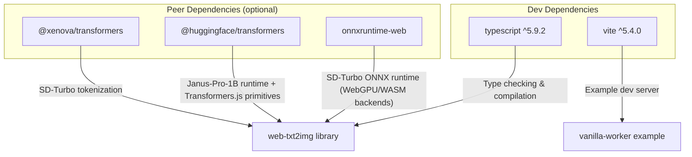
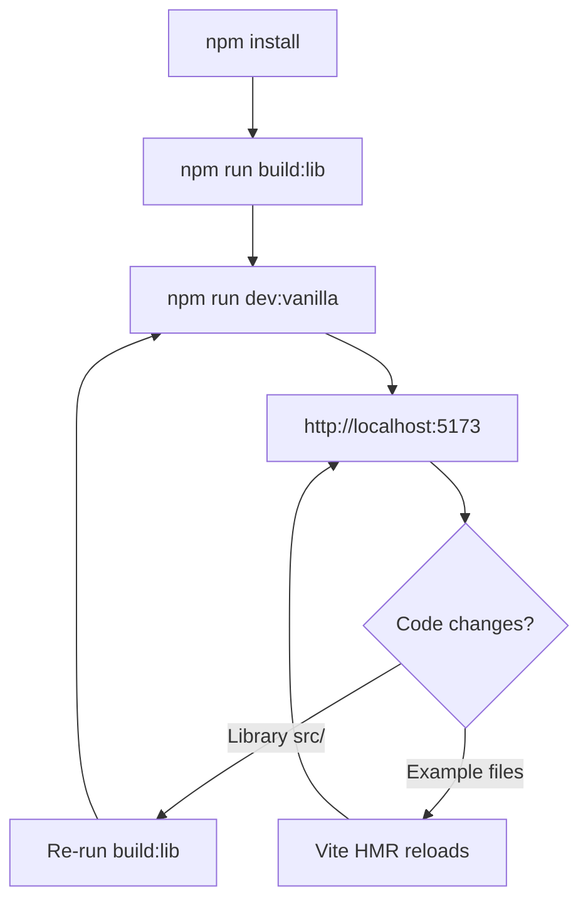

# DevOps Guide

This document covers building, running, testing, and deploying **web-txt2img** — a browser-only text-to-image library.

---

## Table of Contents

- [Environment Setup](#environment-setup)
- [Local Development](#local-development)
- [Production Build](#production-build)
- [Deployment](#deployment)
- [CI/CD Considerations](#cicd-considerations)
- [Troubleshooting](#troubleshooting)

---

## Environment Setup

### Prerequisites

| Requirement | Minimum Version | Notes |
|---|---|---|
| Node.js | 18.x | ESM module support required |
| npm | 9.x | Workspace support |
| TypeScript | 5.9.x | Managed as devDependency |

### Initial Setup

```bash
# Clone the repository
git clone https://github.com/lacerbi/web-txt2img.git
cd web-txt2img

# Install all workspace dependencies (library + examples)
npm install
```

The workspace hoists dependencies to the root `node_modules/`. Both `packages/web-txt2img` and `examples/vanilla-worker` share this dependency tree.

### Dependency Overview



### ONNX Runtime Backend Architecture

ONNX Runtime Web registers multiple execution backends with priority-based selection:

| Backend | Priority | Description |
|---|---|---|
| `webgpu` | 5 | GPU acceleration via WebGPU (recommended) |
| `wasm` | 10 | WebAssembly fallback |
| `cpu` | 10 | CPU execution via WASM |
| `webgl` | -10 | Legacy WebGL (disabled via BUILD_DEFS) |
| `webnn` | 5 | WebNN API (requires WebGPU or JSEP) |

Transformers.js maps device types to ONNX execution providers:
- `webgpu` → WebGPU EP (Chrome/Edge 113+, Safari Tech Preview)
- `wasm` → WASM EP with SIMD (broad compatibility)
- `cpu` → CPU EP via WASM
- Platform-specific: `dml` (Windows), `cuda` (Linux x64), `coreml` (macOS)

### Model Type System

Transformers.js classifies models into architecture types, each with dedicated forward functions and session configs:

| Model Type | Can Generate | Forward Function | Use Case |
|---|---|---|---|
| `DecoderOnly` | ✅ | `decoder_forward` | LLMs, text generation |
| `Seq2Seq` | ✅ | `seq2seq_forward` | Translation, summarization |
| `Vision2Seq` | ✅ | `seq2seq_forward` | Image-to-text |
| `ImageTextToText` | ✅ | `image_text_to_text_forward` | Multimodal VLMs |
| `AudioTextToText` | ✅ | `audio_text_to_text_forward` | Speech-to-text |
| `MultiModality` | ✅ | Custom | Janus-Pro style (text + image gen) |
| `AutoEncoder` | ❌ | `auto_encoder_forward` | VAE, autoencoding |
| `default` | ❌ | `encoder_forward` | Classification, extraction |

Cross-architecture loading is detected: e.g., loading a `ForConditionalGeneration` model via a `ForCausalLM` class automatically switches to text-only mode with the native architecture's config.

---

## Local Development

### Development Workflow



### Commands Reference

#### Library Build

```bash
# Build the library TypeScript → JavaScript
npm run build:lib
# Equivalent to:
cd packages/web-txt2img && npx tsc -p .
```

This compiles `packages/web-txt2img/src/` to `packages/web-txt2img/dist/` with declaration files (`.d.ts`).

#### Type Checking

```bash
# Type check without emitting files
npm run typecheck
# Equivalent to:
cd packages/web-txt2img && npx tsc -p . --noEmit
```

#### Development Server

```bash
# Full dev flow: build library + start example server with HMR
npm run dev:vanilla

# Or manually in two steps:
npm run build:lib
cd examples/vanilla-worker && npm run dev
```

The Vite dev server runs on `http://localhost:5173/` with hot module replacement for example files. Library changes require a rebuild.

#### Clean Build Artifacts

```bash
# Remove all dist directories
npm run clean
# Equivalent to:
rm -rf packages/web-txt2img/dist examples/vanilla-worker/dist
```

### Debugging

#### Library Source Debugging

The TypeScript compiler outputs source maps by default. To debug library code:

1. Run `npm run dev:vanilla`
2. Open Chrome DevTools → Sources panel
3. Navigate to `packages/web-txt2img/src/` via the file navigator
4. Set breakpoints directly in `.ts` source files

#### Worker Thread Debugging

The worker host (`src/worker/host.ts`) runs in a Web Worker thread:

1. Open Chrome DevTools → Sources panel
2. Look for the worker thread under the "workers" section
3. Worker messages are logged via `postMessage` — monitor the Console for protocol messages

#### Common Debug Scenarios

| Issue | Approach |
|---|---|
| Model loading stalls | Check Network tab for HuggingFace CDN requests; verify Cache Storage |
| WebGPU errors | Check `navigator.gpu` availability; verify GPU driver support; check `shader-f16` feature for fp16 dtype |
| Worker communication failures | Monitor `postMessage` calls in Console; check protocol message shapes |
| ONNX Runtime errors | Verify `onnxruntime-web` assets are served from `/ort/`; check `env.wasm.numThreads` setting |
| Session creation fails | Check `InferenceSession.SessionOptions` — `freeDimensionOverrides` must match model's input shapes |
| Memory leaks | Call `session.release()` on ONNX sessions; call `model.dispose()` on Transformers.js models |
| Progress callbacks not firing | Transformers.js uses `progress_callback` — wrap it with `DefaultProgressCallback` for aggregated totals |
| Dtype mismatches | ONNX Runtime uses `float32`/`float16`/`q4`; Transformers.js uses `fp32`/`fp16`/`q4f16`/`q8` |

#### ONNX Runtime Debugging

ONNX Runtime Web uses a backend registration system with priority-based selection:

```javascript
// Check registered backends
import { env } from 'onnxruntime-web';
console.log(env.backends);

// Check execution provider availability
const adapter = await navigator.gpu?.requestAdapter();
console.log(adapter?.features?.has('shader-f16')); // fp16 support
```

Key ONNX Runtime configuration options:
- `executionProviders`: Array of providers to try (e.g., `['webgpu', 'wasm']`)
- `enableMemPattern`: Memory pattern optimization (disable for dynamic shapes)
- `enableCpuMemArena`: CPU memory arena (disable for WebGPU-only)
- `freeDimensionOverrides`: Override batch/sequence dimensions for dynamic shapes

#### Transformers.js Debugging

Transformers.js uses a `Tensor` class that wraps ONNX Runtime tensors:

```javascript
// Check tensor properties
console.log(tensor.dims);      // Shape
console.log(tensor.type);      // Data type ('float32', 'int64', etc.)
console.log(tensor.data);      // Raw data array
console.log(tensor.location);  // 'gpu-buffer', 'cpu', etc.
```

Progress callback shape (from `DefaultProgressCallback`):
```typescript
{
  file: string,        // File being downloaded
  loaded: number,      // Bytes loaded so far
  progress: number,    // 0-1 progress
  total: number,       // Total bytes
  status: string,      // 'downloading', 'done', etc.
}
```

---

## Production Build

### Building for Production

```bash
# Build library + example for production
npm run build:vanilla

# Preview the production build locally
cd examples/vanilla-worker && npm run preview
```

This produces:
- `packages/web-txt2img/dist/` — Compiled library with type declarations
- `examples/vanilla-worker/dist/` — Vite production bundle

### Build Output Structure

```
packages/web-txt2img/dist/
├── index.js              # Main entry point
├── index.d.ts            # Type declarations
├── cache.js / cache.d.ts
├── capabilities.js / .d.ts
├── registry.js / .d.ts
├── types.d.ts
├── adapters/
│   ├── sd-turbo.js / .d.ts
│   └── janus-pro.js / .d.ts
└── worker/
    ├── client.js / .d.ts
    ├── host.js / .d.ts
    └── protocol.js / .d.ts
```

### NPM Package Publishing

```bash
# From packages/web-txt2img/
cd packages/web-txt2img

# Prepack hook auto-runs build before packing
npm pack

# Publish to npm (requires npm login)
npm publish
```

The `prepublishOnly` and `prepack` scripts ensure the library is built before publishing.

---

## Deployment

### Static Hosting

The example app is a static SPA — deploy the `examples/vanilla-worker/dist/` directory to any static host:

```bash
# Build
npm run build:vanilla

# Deploy dist/ to your host
# Examples:
# - GitHub Pages
# - Vercel / Netlify
# - Cloudflare Pages
# - AWS S3 + CloudFront
```

### Deployment Checklist

- [ ] Library built (`npm run build:lib`)
- [ ] Example built (`npm run build:vanilla`)
- [ ] ONNX Runtime WASM assets copied (`scripts/copy-ort-assets.cjs` runs automatically)
- [ ] Base path configured if deploying to subdirectory (`BASE_PATH` env var)
- [ ] CORS headers allow HuggingFace CDN access
- [ ] WebGPU available in target browsers (no server-side requirement)

### Environment Variables

| Variable | Default | Description |
|---|---|---|
| `BASE_PATH` | `/` | Base URL path for subdirectory deployments |

### Hosting Considerations

- **No server required**: All inference runs client-side in the browser via WebGPU
- **Model downloads**: ~2.25–2.34 GB per model, cached in browser Cache Storage
- **CORS**: Ensure HuggingFace CDN (`huggingface.co`) is accessible from your domain
- **Bandwidth**: First-time users download model weights; subsequent visits use cache

---

## CI/CD Considerations

### Recommended Pipeline Steps


### Minimal GitHub Actions Example

```yaml
name: Build
on: [push, pull_request]

jobs:
  build:
    runs-on: ubuntu-latest
    steps:
      - uses: actions/checkout@v4
      - uses: actions/setup-node@v4
        with:
          node-version: 18
      - run: npm install
      - run: npm run typecheck
      - run: npm run build:lib
      - run: npm run build:vanilla
      - uses: actions/upload-artifact@v4
        with:
          name: web-txt2img-dist
          path: examples/vanilla-worker/dist/
```

### Notes

- No Node.js-native modules; builds are pure TypeScript compilation
- No test suite currently exists; consider adding unit tests for the protocol and adapter interfaces
- WebGPU cannot be tested in headless CI; integration tests require a browser with WebGPU support

---

## Troubleshooting

### Build Failures

| Symptom | Cause | Fix |
|---|---|---|
| `Cannot find module 'onnxruntime-web'` | Peer dependency not installed | `npm install onnxruntime-web` |
| TypeScript errors in `dist/` | Stale build artifacts | `npm run clean && npm run build:lib` |
| Worker fails to load | `host.js` shim missing | Ensure `src/worker/host.js` exists |

### Runtime Issues

| Symptom | Cause | Fix |
|---|---|---|
| WebGPU not detected | Browser too old / GPU unsupported | Use Chrome/Edge 113+; check `navigator.gpu` |
| Model download fails | Network / CORS issue | Check network connectivity to HuggingFace |
| Worker hangs on generate | Model not loaded | Call `client.load()` before `client.generate()` |
| ORT WASM assets 404 | Assets not copied | Run `scripts/copy-ort-assets.cjs` |
| Session creation fails | Shape mismatch | Provide `freeDimensionOverrides` matching model inputs |
| Out of memory | Too many sessions | Call `session.release()` after use; limit concurrent models |
| Dtype error | fp16 unsupported | Check `shader-f16` feature; fall back to `fp32` |
| Tensor location mismatch | GPU/CPU mismatch | Ensure all tensors use same device (`gpu-buffer` vs `cpu`) |
| Progress stalls | Cached files | Check Cache Storage; use `purgeCache()` to clear stale entries |

### ONNX Runtime Build Configurations

ONNX Runtime Web supports multiple build configurations controlled by `BUILD_DEFS`:

| Flag | Default | Effect |
|---|---|---|
| `DISABLE_WEBGL` | false | Disables legacy WebGL backend |
| `DISABLE_WASM` | false | Disables WASM/CPU backend |
| `DISABLE_WEBGPU` | false | Disables WebGPU backend |
| `DISABLE_JSEP` | false | Disables JSEP (WebGPU shader compilation) |
| `DISABLE_WEBNN` | false | Disables WebNN backend |

Note: JSEP and WebGPU EP cannot be enabled simultaneously. WebNN requires either JSEP or WebGPU EP.

### Transformers.js Device and Dtype Selection

Transformers.js supports per-submodel device and dtype assignment:

```typescript
// Example: Split model across devices with mixed precision
const dtype = {
  prepare_inputs_embeds: 'q4',      // Quantized for small model
  language_model: 'q4f16',          // Quantized with fp16 compute
  lm_head: 'fp16',                 // Half precision
  gen_head: 'fp16',
  gen_img_embeds: 'fp16',
  image_decode: 'fp32',            // Full precision for output
};

const device = {
  prepare_inputs_embeds: 'wasm',    // Small model on WASM
  language_model: 'webgpu',         // Large model on GPU
  lm_head: 'webgpu',
  gen_head: 'webgpu',
  gen_img_embeds: 'webgpu',
  image_decode: 'webgpu',
};
```

Supported dtypes: `fp32`, `fp16`, `q4`, `q4f16`, `q8`
Supported devices: `webgpu`, `wasm`, `cpu`, `coreml`, `cuda`, `dml`
