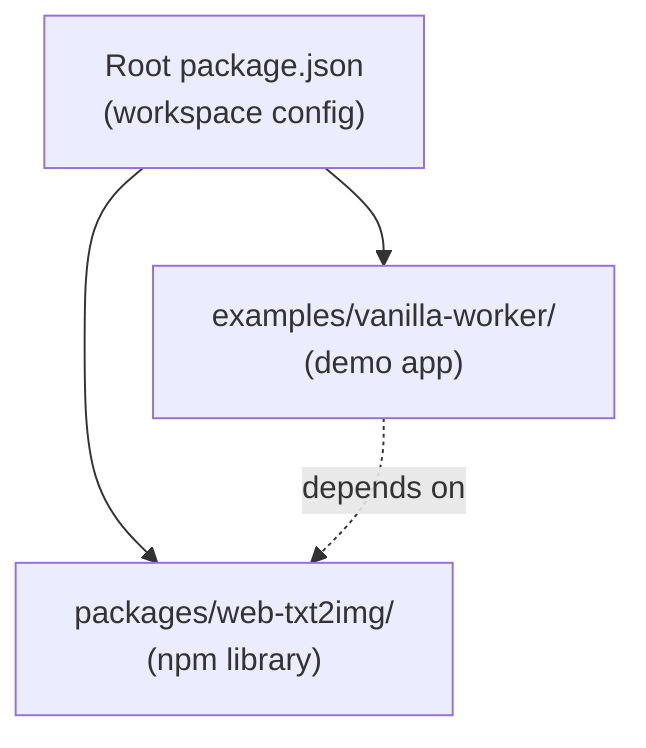
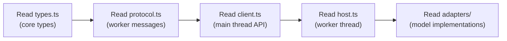
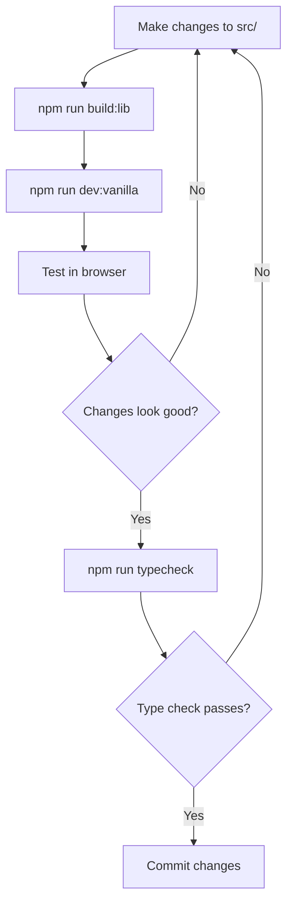

# Onboarding Guide

Welcome to **web-txt2img**! This guide will help you get up to speed with the project, understand how things work, and start contributing quickly.

---

## Table of Contents

- [What Is This Project?](#what-is-this-project)
- [Quick Start](#quick-start)
- [Project Structure](#project-structure)
- [Key Concepts](#key-concepts)
- [How To](#how-to)
- [Development Workflow](#development-workflow)
- [Testing Your Changes](#testing-your-changes)
- [Common Tasks](#common-tasks)
- [Resources](#resources)

---

## What Is This Project?

**web-txt2img** is a browser-only JavaScript/TypeScript library that generates images from text prompts using AI models running entirely client-side via WebGPU. No server required — all inference happens in the user's browser.

### Why This Matters

- **Privacy**: Images are generated locally; no data leaves the user's device
- **No backend costs**: No GPU servers to maintain
- **Offline capable**: Models are cached in the browser after first download
- **Portable**: Works anywhere a modern browser with WebGPU is available

### Supported Models

| Model | Runtime | Size | Backend |
|---|---|---|---|
| **SD-Turbo** | ONNX Runtime Web | ~2.34 GB | WebGPU |
| **Janus-Pro-1B** | Transformers.js | ~2.25 GB | WebGPU |

---

## Quick Start

### 1. Clone and Install

```bash
git clone https://github.com/lacerbi/web-txt2img.git
cd web-txt2img
npm install
```

### 2. Build the Library

```bash
npm run build:lib
```

### 3. Run the Example App

```bash
npm run dev:vanilla
```

Open `http://localhost:5173/` in Chrome or Edge (WebGPU required).

### 4. Try Generating an Image

1. Select a model from the dropdown
2. Click **Load** and wait for the model to download (~2-3 GB)
3. Enter a prompt and click **Generate**
4. The generated image appears below

---

## Project Structure

```
web-txt2img/
├── package.json                  # Workspace root (npm workspaces)
├── packages/
│   └── web-txt2img/             # Main library (published to npm)
│       ├── package.json
│       ├── tsconfig.json
│       └── src/
│           ├── index.ts         # Public API entry point
│           ├── types.ts         # Core type definitions
│           ├── registry.ts      # Model registry and factories
│           ├── capabilities.ts  # Browser feature detection
│           ├── cache.ts         # Cache Storage wrapper
│           ├── adapters/
│           │   ├── sd-turbo.ts  # SD-Turbo adapter (ONNX Runtime)
│           │   └── janus-pro.ts # Janus-Pro-1B adapter (Transformers.js)
│           └── worker/
│               ├── client.ts    # Main-thread worker client
│               ├── host.ts      # Worker thread entry point
│               └── protocol.ts  # Worker message types
├── examples/
│   └── vanilla-worker/          # Example Vite app
│       ├── index.html
│       ├── main.js
│       ├── styles.css
│       ├── vite.config.ts
│       └── scripts/
│           └── copy-ort-assets.cjs
└── docs/
    ├── DEVOPS.md
    ├── ARCHITECTURE.md
    └── ONBOARDING.md            # ← You are here
```

### Monorepo Layout

This is an **npm workspaces** monorepo:



---

## Key Concepts

### 1. Worker-First Design

All inference runs in a **Web Worker** to keep the UI responsive:

```
Main Thread          Web Worker
     │                    │
     │── load() ────────▶│
     │◀── result ────────│
     │                    │
     │── generate() ────▶│──▶ Adapter.generate()
     │◀── progress ──────│◀── progress events
     │◀── result(blob) ──│
```

- **Client** (`src/worker/client.ts`): Main-thread API
- **Host** (`src/worker/host.ts`): Worker-thread message router
- **Protocol** (`src/worker/protocol.ts`): Type-safe message types

### 2. Adapter Pattern

Each model is an **adapter** implementing a common interface:

```typescript
interface Adapter {
  checkSupport(capabilities): BackendId[];
  load(options): Promise<LoadResult>;
  isLoaded(): boolean;
  generate(params): Promise<GenerateResult>;
  unload(): Promise<void>;
  purgeCache(): Promise<void>;
}
```

To add a new model:
1. Create `src/adapters/my-model.ts` implementing `Adapter`
2. Register it in `src/registry.ts`

### 3. Result Types

The library uses **result objects** instead of exceptions:

```typescript
// Success
{ ok: true, blob: Blob, timeMs: number }

// Failure
{ ok: false, reason: 'model_not_loaded', message: '...' }
```

### 4. Progress Reporting

Standardized progress events include:

```typescript
interface ProgressEvent {
  phase: 'loading' | 'tokenizing' | 'encoding' | 'denoising' | 'decoding' | 'complete';
  pct?: number;              // 0-100 percentage
  bytesDownloaded?: number;
  totalBytesExpected?: number;
  message?: string;
}
```

---

## How To

### How to Understand the Code Flow

Start here and follow the arrows:



### How to Add a New Model

1. **Create the adapter**: `src/adapters/my-model.ts`

```typescript
import type { Adapter, BackendId, Capabilities, GenerateParams, GenerateResult, LoadOptions, LoadResult } from '../types.js';

export class MyModelAdapter implements Adapter {
  readonly id = 'my-model' as const;
  private loaded = false;

  checkSupport(c: Capabilities): BackendId[] {
    return c.webgpu ? ['webgpu'] : [];
  }

  async load(options: LoadOptions): Promise<LoadResult> {
    // Download and initialize model
    return { ok: true, backendUsed: 'webgpu' };
  }

  isLoaded(): boolean { return this.loaded; }

  async generate(params: Omit<GenerateParams, 'model'>): Promise<GenerateResult> {
    // Run inference
    throw new Error('Not implemented');
  }

  async unload(): Promise<void> {}
  async purgeCache(): Promise<void> {}
}
```

2. **Register in `registry.ts`**:

```typescript
import { MyModelAdapter } from './adapters/my-model.js';

// Add to REGISTRY array:
{
  id: 'my-model',
  displayName: 'My Model',
  task: 'text-to-image',
  supportedBackends: ['webgpu'],
  createAdapter: () => new MyModelAdapter(),
}
```

3. **Update `types.ts`**: Add `'my-model'` to the `ModelId` union type.

### How to Debug Worker Issues

1. Open Chrome DevTools → **Sources** panel
2. Find the worker thread under the "workers" section
3. Set breakpoints in `host.ts` or adapter files
4. Monitor `postMessage` calls in the **Console**

### How to Modify the Example App

The example app is a minimal Vite project:

```bash
# Edit files in examples/vanilla-worker/
# Rebuild library if you changed library code
npm run build:lib

# Restart dev server if needed
npm run dev:vanilla
```

---

## Development Workflow

### Typical Session



### Git Workflow

```bash
# Check types before committing
npm run typecheck

# Build to verify compilation
npm run build:lib

# Clean if needed
npm run clean
npm run build:lib
```

---

## Testing Your Changes

### Manual Testing

Since the library runs in the browser, the primary testing method is manual:

1. Build: `npm run build:lib`
2. Run example: `npm run dev:vanilla`
3. Test in Chrome/Edge with WebGPU enabled

### What to Verify

| Change Type | Test |
|---|---|
| Type definitions | `npm run typecheck` |
| Library compilation | `npm run build:lib` |
| Worker communication | Load model + generate image in example app |
| Progress reporting | Check console for progress events |
| Model switching | Load → unload → load different model |
| Abort handling | Click abort during generation |
| Cache behavior | Reload page; model should load faster |

---

## Common Tasks

### Check Browser Compatibility

```bash
# Open the example app and check the capabilities display
npm run dev:vanilla
# The app shows detected capabilities on the page
```

### Clear Model Cache

In the browser console:
```javascript
// Using the client
await client.purgeAll();

// Or directly
await caches.delete('web-txt2img-v1');
```

### Switch Between Models

```javascript
// Unload current model
await client.unload();

// Load different model
await client.load('janus-pro-1b');
```

### Profile Performance

1. Open Chrome DevTools → **Performance** panel
2. Record while generating an image
3. Check WebGPU usage in `chrome://gpu`

---

## Resources

### Internal Documentation

| Document | Purpose |
|---|---|
| [ARCHITECTURE.md](./ARCHITECTURE.md) | Module architecture, data flow, interfaces |
| [DEVOPS.md](./DEVOPS.md) | Building, running, deploying |
| [DEVELOPER_GUIDE.md](./DEVELOPER_GUIDE.md) | Advanced worker protocol details |

### External References

| Resource | Link |
|---|---|
| WebGPU API | https://www.w3.org/TR/webgpu/ |
| ONNX Runtime Web | https://onnxruntime.ai/docsexecution-providers/webgpu.html |
| Transformers.js | https://huggingface.co/docs/transformers.js |
| SD-Turbo Model Card | https://huggingface.co/stabilityai/sd-turbo |
| Janus-Pro Paper | https://arxiv.org/html/2501.17811v1 |

### Browser Requirements

- **Chrome/Edge**: 113+ (WebGPU stable)
- **Safari**: Technology Preview (WebGPU flag)
- **Firefox**: Nightly (WebGPU flag)

---

## Getting Help

- **Issues**: https://github.com/lacerbi/web-txt2img/issues
- **Discussions**: Check GitHub Discussions tab
- **Code questions**: Read `docs/DEVELOPER_GUIDE.md` for advanced topics
